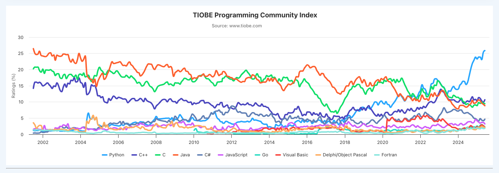

# Why Python

## Because that's what Envision uses!
- Technically also R

## Popularity
- Python is extremely popular.  And it has been.
- [TIOBE Index](https://www.tiobe.com/tiobe-index/)



- Java and C are the orange and green respectively.


## Python is incredibly useful for general computing as well as specific domains
- Serial / Byte level manipulation (note: not fastest)
- Natural Language Processing
- Machine Learning
- Web Development
- Not apps!

## Huge library of modules
- [PyPi](https://pypi.org/)
- ✅ There probably already exists a library to do the thing you want to do.
- ⚠️ Libraries can be sketchy!
    - [PyPI, npm, and AI Tools Exploited in Malware Surge Targeting DevOps and Cloud Environments](https://thehackernews.com/2025/06/malicious-pypi-package-masquerades-as.html)
    - sketchy contributors, etc.
    - Crypto malware in AI stuff because you expect your graphics card to spin up.

## ⏩ Extremely fast deployments!
- Pair python with your favorite cloud provider and you can deploy in minutes.
- Cloud evolution:
    1. Virtual Machines (you manage the whole OS)
    2. Platform as a Service (you manage the container)
    3. Cloud Functions (You just provide the app.)

## What's the catch? Python is (byte-code) **Interpreted**.
- It is NOT fast compared to compiled languages normally.
- Compiled langauges take SOURCE → (linkers, etc.) → (optimizations) → BINARY
- Interpreted Languages parse strings and do stuff based on what the string says.  (it's more scripting)
- Byte-code is the goldilocks SOURCE → Bytecode → Python VM
    - Bytecode is MUCH faster to interpret than raw strings
    - Python VM can be a number of different implementations
        - CPython VM
        - MicroPython
        - Jython
- You get a REPL! You can test stuff very easily
- Example: What's the Error that's thrown when I try to change an immuatable string?

```
Python 3.11.6 (v3.11.6:8b6ee5ba3b, Oct  2 2023, 11:18:21) [Clang 13.0.0 (clang-1300.0.29.30)] on darwin
Type "help", "copyright", "credits" or "license" for more information.
>>> s = 'Hello'
>>> s[2] = 'X'
Traceback (most recent call last):
  File "<stdin>", line 1, in <module>
TypeError: 'str' object does not support item assignment
>>> 
```

## We can VERY quickly test out sections of code, try things, etc.

- given a file `hello.py`

- we can easily load and test functions

```
💣 mikecorey 0 👉 python
Python 3.11.6 (v3.11.6:8b6ee5ba3b, Oct  2 2023, 11:18:21) [Clang 13.0.0 (clang-1300.0.29.30)] on darwin
Type "help", "copyright", "credits" or "license" for more information.
>>> import hello
>>> hello.hello()
👋 hello world
>>> import bad_hello
Traceback (most recent call last):
  File "<stdin>", line 1, in <module>
  File "/Users/mikecorey/workspace/py101/0/bad_hello.py", line 1
    def main:
            ^
SyntaxError: expected '('
>>> 
```

- we can `import` files (much more on this later) and call the functions within them
- if we try to `import` a file with a syntax error it will throw the error

