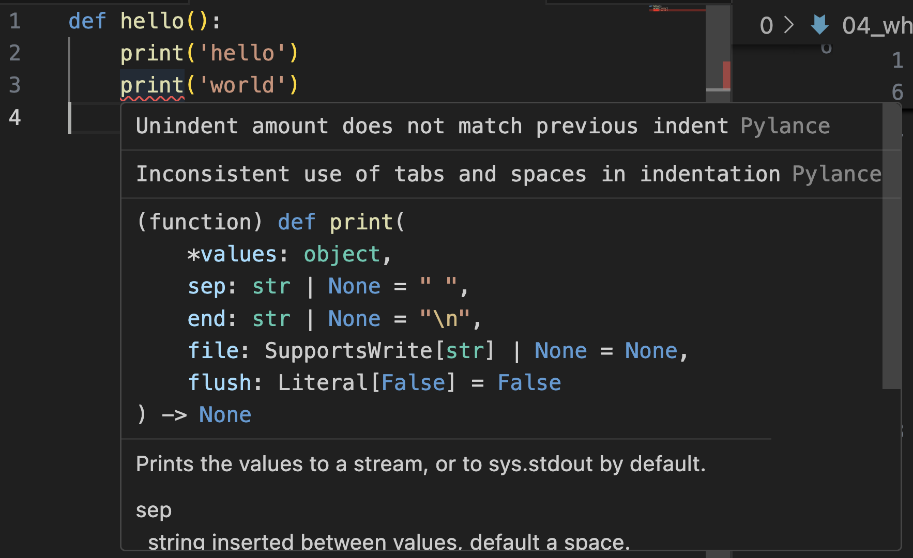

# Hello World

- Note: We're going to dive into Python's syntax more later, basically everything here has caveats, don't stress it for now.
- Python's Syntax is efficient
- Whitespace matters
- boilerplate is tiny!

## C

```c
#include <stdio.h>

int main() {
    printf("Hello, World!\n");
    return 0;
}
```

- You have to include standard io to print
- You have to provide a function return type
- Every line terminates with a semicolon.
  - In theory you could write the entire main function on one line


## Java

```java
public class HelloWorld {
    public static void main(String[] args) {
        System.out.println("Hello, World!");
    }
}
```

- Java ❤️ boilerplate code.
- classes need visibility defined `public`
- So many classes in java.

## Python
```python
def hello():
    print('Hello, world!')

hello()
```

- Very simple, you define a function, then call it.
- Technically your file could just be:
- `def` defines a function.  In this case it's named `hello`.
- functions can take zero or more variables.  This takes zero which is denoted by `()`
- function definitions must end in `:`
- everything within the function must be indented
  - Tabs / Spaces.  You make the call but be consistent!
  - Seriously, this is incredibly frustrating.  Especially if you 'borrowed' code from somewhere else.
  - 
- `print` is a function that writes output to stdout (Standard Out)
- `hello()` calls the function and passes zero arguments to it (as expected)

## Alternatively
- you could technically just put `print('hello')` in a file and it would also work. but that seems like a bit of an unfair comparison.
```python
print("Hello, World!')
```
- TAKEAWAY: where C and Java normally expect an entry point `main` python just starts at the top and runs.


# How to run them
## C
```bash
gcc hello.c -o hello
./hello
```

- NOTE: Again that's two steps, One to compile, one to run.
- The output object `hello` does NOT run on other platforms.

## Java
```bash
javac Hello.java
java Hello
```

- This is two steps because we're manually compiling to bytecode then running
- We then run the output class `Hello` (Capitals matter in Java if i recall)
- This is confusing as `Hello.class` is the actual file.
- This *should* run across platforms.  Assuming anything OS specific was omitted


## Python
```bash
python hello.py
```

- Much Cleaner, single step. No additional step for compilation to bytecode.
- An internal `__pycache__` will be made which contains the .pyc file. (assuming imports are used otherwise it's just in memory) But it's transparent to you.

## Comments
Comments are portions of the file which will not be interpreted by the Python VM.

We create comments with

`# This is a comment`

We can make a block of comment which spans multiple lines by defining a muilt-line string.

```python
print('hello')
''' This
is a multi-line
comment.
'''
print('bye')

```

(If you want to be wildly picky.  This isn't a comment.  It's technically a string that is never assigned but uses memory briefly.)

When debugging you can certainly just comment out blocks of code and they will not be run.  Be careful with this.  Also your code will become ugly.
