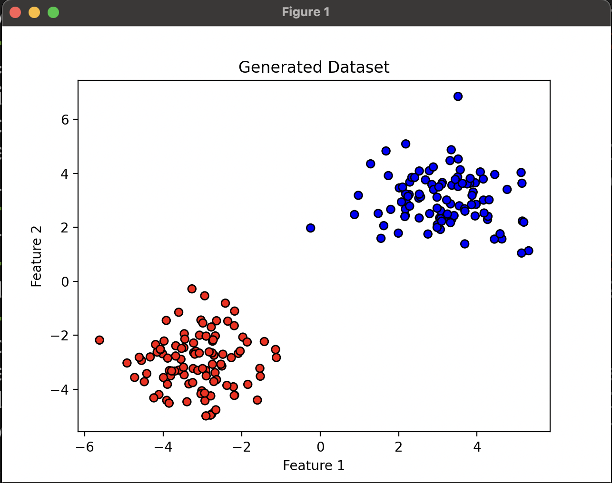

# Exercise - Classification

you have been given a dataset of 2d.  This was generated programmatically and is 2 gaussian distributions.  Your task is to build a classifier (Logistic Regression) such that you can classify whether a new point belongs to class 1 or 2.

