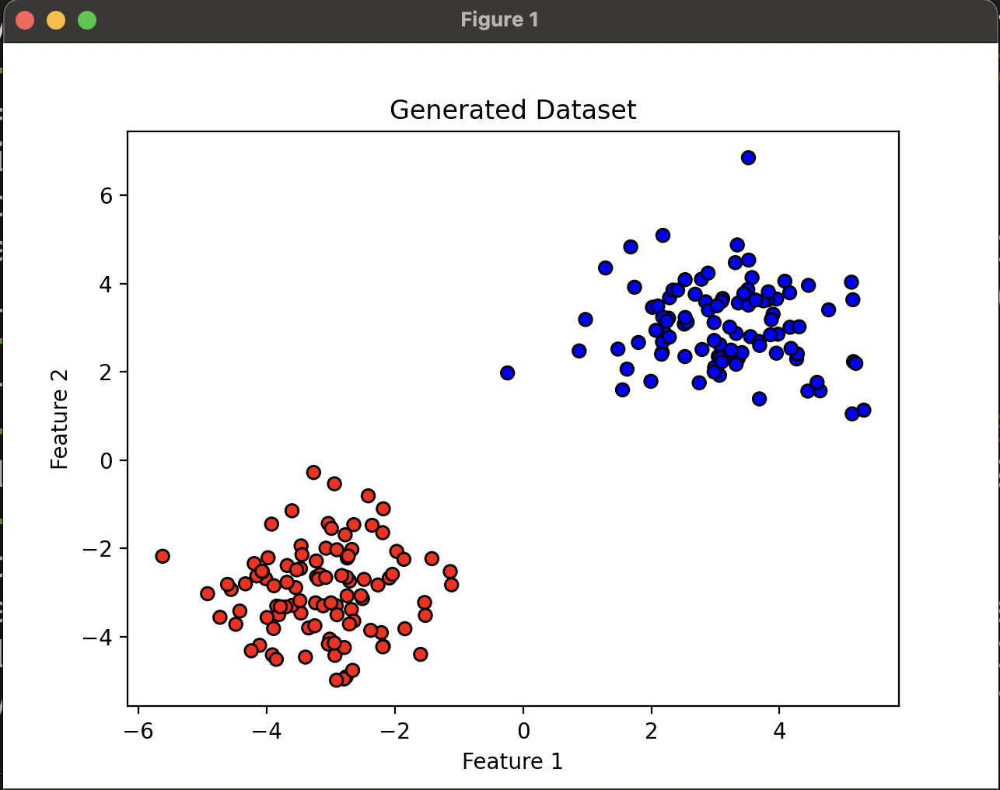
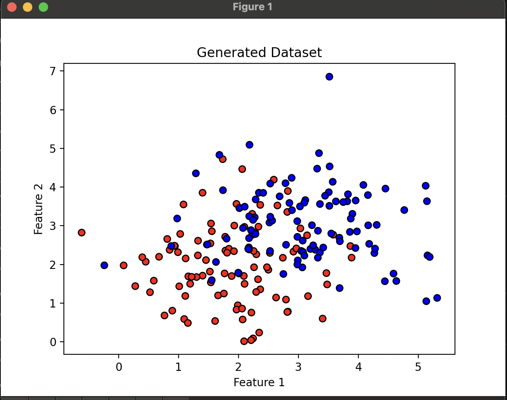

# Exercise - Classification

you have been given a dataset of 2d.  This was generated programmatically and is 2 gaussian distributions.  Your task is to build a classifier (Logistic Regression) such that you can classify whether a new point belongs to class 1 or 2.





```python
import pandas as pd
from sklearn.linear_model import LogisticRegression
from sklearn.model_selection import train_test_split
from sklearn.metrics import accuracy_score


df = pd.read_csv('2d_gaussians_hard.csv')

X = df.drop('label', axis=1)
y = df['label']

X_train, X_test, y_train, y_test = train_test_split(X, y, test_size=0.2)

clf = LogisticRegression(max_iter=1000)
clf.fit(X_train, y_train)

y_pred = clf.predict(X_test)

print("Accuracy:", accuracy_score(y_test, y_pred))
```